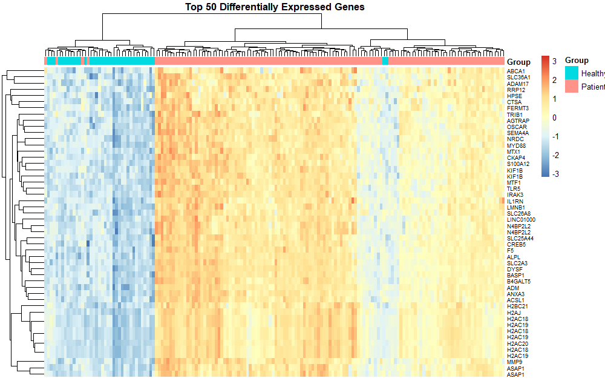

# Whole blood Transcriptional Profiles as a Prognostic and Diagnostic Tool in Complete and Incomplete Kawasaki Disease
## GEO Analysis with R Script

### **INTRODUCTION**
Kawasaki Disease (KD) is an acute, systemic vasculitis of unknown etiology that primarily affects infants and children, characterized by prolonged fever and inflammation of the medium-sized blood arteries, most notably the coronary arteries. Because its clinical symptoms often overlap with other pediatric febrile illnesses, such as adenovirus and streptococcal infections, achieving an early and accurate diagnosis is critical to preventing long-term cardiac complications. To address this challenge, researchers have increasingly turned to genomic medicine to identify molecular signatures unique to the disease.

In a landmark study, researchers conducted a comprehensive transcriptomic analysis involving five distinct clinical groups: patients with complete Kawasaki Disease, those with incomplete (atypical) Kawasaki Disease, children with Adenovirus (HAdV), patients with Group A Streptococcal disease (GAS), and a cohort of healthy controls. By comparing the gene expression patterns across these groups, the study sought to define a "biosignature" that could objectively distinguish KD from its clinical mimics. The resulting data from this extensive profiling has been made publicly available through the Gene Expression Omnibus (GEO) under the accession number GSE68004, serving as a vital resource for understanding the inflammatory pathways and diagnostic biomarkers associated with the condition.

### **METHODS**
The methodology employed in this analysis utilizes the R programming language and several specialized Bioconductor packages, such as GEOquery and limma, to process the GSE68004 dataset from the Illumina HumanHT-12 V4.0 platform. The workflow begins by retrieving the raw expression data and performing log2 transformation and quantile normalization to ensure data consistency across samples. Following pre-processing, a linear model is applied via the limma package to conduct differential expression analysis, comparing the transcriptional profiles of Kawasaki Disease patients against healthy controls. To identify significant biomarkers, the data is filtered based on adjusted p-values and log-fold change (logFC) thresholds. Finally, the results are visualized through high-dimensional data techniques, including the generation of a Volcano Plot to highlight significantly up-regulated and down-regulated genes, a Heatmap to display the expression patterns of the top 50 genes, and UMAP (Uniform Manifold Approximation and Projection) to assess the natural clustering and separation between the clinical groups.

### **RESULT AND DISCUSSION**
**A. Differential Gene Expression Analysis**

Based on the linear modeling of the dataset, the analysis identified a robust set of genes that are significantly altered in KD patients. Upregulated genes, such as H2AC20 (H2A Clustered Histone 20), H2AJ (H2A.J Histone), and LCN2 (Lipocalin 2), represent the dominant signature of the disease, indicating a massive mobilization of the innate immune response. Conversely, downregulated genes, which include markers like CCR7 and TCF7, often suggest a shift in the T-cell population or a temporary suppression of adaptive immunity during the acute febrile state. The Volcano Plot visually captures this divergence, with the most significant genes appearing at the top left and right extremes.

**B. Top 50 Differentially Expressed Genes (DEGs)**

The 50 Differentially Expressed Genes (DEGs) identified serve as the core molecular "fingerprint" of the disease. These top-tier genes exhibit a consistent and sharp contrast in expression levels between groups. When visualized via a heatmap, these genes exhibit clear clustering: the "sick" group displays a highly uniform block of intense activity for inflammatory and cell-cycle related markers, whereas the healthy group maintains a stable, baseline expression. This high degree of separation confirms that these genes are highly reliable candidates for molecular diagnostics.

**C. Gene Ontology and KEGG Pathway**

Enrichment analysis maps the raw gene list to biological systems to explain the "why" behind the expression changes. The pathway flow typically follows this progression:
1. Stimulus Detection: Recognition of an unknown trigger (pathogen or self-antigen) by the innate immune system.
2. Signal Transduction: Activation of core pathways like NF-kappa B and IL-17 signaling.
3. Cellular Response: Massive Neutrophil Activation and myeloid leukocyte-mediated immunity (as seen in GO terms).
4. Systemic Effect: Induction of the Coagulation Cascade and cytokine production, leading to the clinical manifestations of vasculitis and coronary inflammation.

**D. Clinical Interpretation**

The divergence between the gene expression of a sick patient and a healthy individual resides in the hyper-activation of the innate immune system. In KD patients, the blood transcriptome shifts toward a "pro-inflammatory" state where genes responsible for neutrophil degranulation and cell cycle progression are overexpressed to combat the systemic inflammation. This molecular deviation explains the clinical presentation of high, persistent fever. Furthermore, because these transcriptional changes occur before some clinical symptoms are fully manifest, this signature acts as a superior diagnostic indicator compared to traditional markers, allowing for more precise differentiation from viral mimics.

### **CONCLUSION**

The transcriptomic analysis of the GSE68004 dataset demonstrates that Kawasaki Disease triggers a distinct and measurable "biosignature" in the blood, characterized by the significant upregulation of key inflammatory and histone-related genes such as H2AC20, H2AJ, and LCN2. By employing a rigorous computational workflow—moving from normalization and differential expression to functional enrichment—the study reveals a coordinated biological response where innate immune pathways, specifically neutrophil activation and IL-17 signaling, become hyper-active. This molecular shift not only provides a high-resolution tool for distinguishing KD from clinical mimics like adenovirus but also offers a predictive framework for identifying treatment non-responders. Ultimately, integrating these genomic insights into clinical practice represents a significant step toward more precise, early diagnosis and personalized management of pediatric vasculitis.

### **REFERENCES**
Jaggi P, Mejias A, Xu Z, Yin H et al. 2016. Whole blood Transcriptional Profiles as a Prognostic and Diagnostic Tool in Complete and Incomplete Kawasaki Disease. (GSE 68004).
